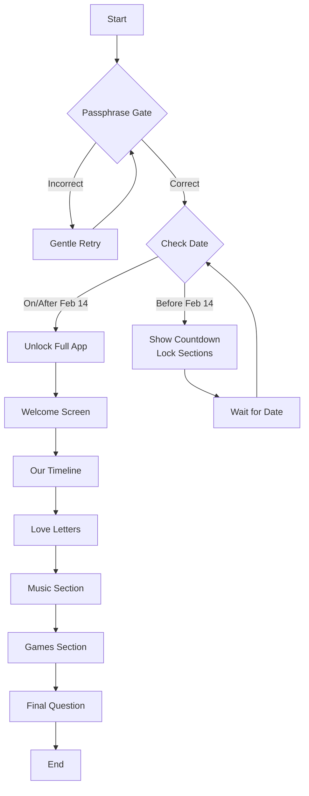

# Valentine Web App Plan

## Overview
A private, romantic Valentine-themed interactive web app built with HTML, CSS, and Vanilla JavaScript. Optimized for Netlify free hosting, mobile-first responsive design. Includes passphrase gate, countdown logic, and multiple sections for memories, letters, music, and games.

## Key Features
- **Passphrase Gate**: Question "What is our password?" with answer "18ALZ_XO_@Mahl3!25". Gentle retry on incorrect answer.
- **Countdown Logic**: Checks current date (SAST). If before Feb 14, shows countdown and locks sections. Unlocks automatically on/after Feb 14.
- **App Sections** (unlocked):
  - Welcome screen with animation and "Begin" button
  - Our Timeline: Scrollable memory cards with images/videos, dates, captions
  - Love Letters: Digital handwritten style with envelope animation
  - Music: Embedded audio player with captions
  - Games: Simple quiz with riddle unlock
  - Final Question: Playful response about future updates

## Design
- Valentine aesthetic: soft, romantic, intimate colors
- Smooth, lightweight animations
- Mobile-first, responsive
- No clutter

## Technical Stack
- Static web app (HTML, CSS, JS)
- No backend, databases, auth, or paid APIs
- Optimized for Netlify

## Project Structure
```
valentine-app/
├── index.html
├── css/
│   └── styles.css
├── js/
│   └── app.js
├── assets/
│   ├── images/ (placeholders)
│   ├── audio/ (placeholders)
│   └── video/ (placeholders)
├── instructions.md
└── plans/
    └── plan.md
```

## App Flow Diagram


## Todo List
- [ ] Set up project folder structure (index.html, css/, js/, assets/)
- [ ] Create basic HTML structure with sections for gate, countdown, and app content
- [ ] Implement passphrase gate with question "What is our password?" and answer "18ALZ_XO_@Mahl3!25"
- [ ] Add JavaScript for date checking and countdown logic (Valentine's Day Feb 14 SAST)
- [ ] Create welcome screen with animation and "Begin" button
- [ ] Build timeline section with scrollable memory cards (placeholders for images/videos)
- [ ] Develop love letters section with envelope animation and handwritten style
- [ ] Implement music section with embedded audio player and captions
- [ ] Create games section with simple quiz and riddle mechanics
- [ ] Add final question screen with playful response
- [ ] Style with Valentine aesthetic: soft colors, animations, mobile-first responsive design
- [ ] Add placeholder images, audio, and video files
- [ ] Write instructions file for adding memories, editing text, replacing assets, and adjusting date
- [ ] Test app functionality, responsiveness, and optimize for Netlify hosting

## Deliverables
- Clean, commented code
- Placeholder assets
- Instructions for customization
- Easy to extend and maintain

## Next Steps
Once approved, switch to Code mode to implement the app.